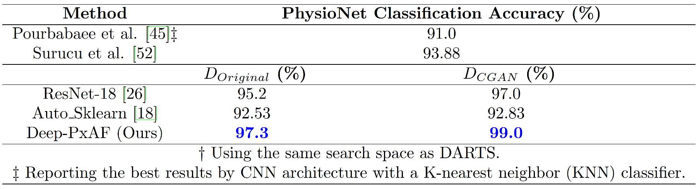

# Accurate Detection of Paroxysmal Atrial Fibrillation with Certified-GAN and Neural Architecture Search

This paper presents the results of a novel machine learning method for detecting Paroxysmal
Atrial Fibrillation (Deep-PxAF), a pathological characteristic of Electrocardiogram (ECG) that can lead
to fatal conditions such as heart attack. To enhance the learning process, this method involves a
Generative Adversarial Network (GAN) along with a Neural Architecture Search (NAS) in the data
preparation and classifier optimization phases. 

Following is a snippet of key results.


## Installation
First, clone the repository.  

```pyhton
git clone https://github.com/0mehdi0/ECG-NAS.git && cd ECG-NAS
```
Then you need to run GAN model to genrate synthetic ecg data and add them to DARTS or 
you can download them from here.
<br />
(Selected_GAN.pt): [link](https://drive.google.com/file/d/1j1wuQjeUR02wKyAllhOwo_dE0MjF0Oop/view?usp=sharing) ,  and (GAN_Data.pt): [link](https://drive.google.com/file/d/1-Tz5bikmHLaK8ds2r8D1Uzlw89XMD-pW/view?usp=sharing) 

* `GAN_Data`: 10000 synthetic ecg data was given form our GAN saved model.
* `Selected_GAN`: selected indexes were chosen by expert physician.

After that you should download below files : 
(dataset_PAF.pkl): [link](https://drive.google.com/file/d/1G5uFIGllmJIk05G1Acp2IItjK159XQhC/view?usp=sharing) ,
(Selected_PAF.csv): [link](https://drive.google.com/file/d/1vAn5PieATTsYW7TCHYrU38zWtpIPc8R9/view?usp=sharing),(finalindex.pt): [link]()

* `dataset_PAF`: Full dataset.
* `Selected_PAF`: Selected indexes of PAF dataset were chosen by expert physician.
* `finalindex`: Train and test indexes.

Next, move `finalindex.pt`, `dataset_PAF.pkl`, `Selected_PAF.csv`, `GAN_Data.pt`, `Selected_GAN.pt` to the datasets folder.
<br />
Then, install requirements by running: 
<br />
```pyhton
pip install -r requirements.txt
```


## Run the Repository

### Run the signal processing 

To evaluate the signal processing:
<br />

```python
python signalprocess_1ch.py
```
### Run the GAN
See the instructions in GAN folder.
### Run the NAS
To search for the best CNN architecture for the processed 2D images with randomseed 100 and synthetic data:<br />
```python
python search_1ch_3class.py --seed 100 --GAN_flag" 1
```
To fine-tune the best designed architecture:<br />
```python
python retrain3class.py --seed 100 --GAN_flag" 1
```
## Database
The original database is downloaded from the PhysioNet PAF prediction challenge through the following link: https://physionet.org/content/afpdb/1.0.0/

## Contributors

* [Mohammad Loni](http://www.es.mdh.se/staff/3662-)
* [Mehdi Asadi](https://ir.linkedin.com/in/mehdi-asadi-966a1b242?trk=)

Some of the code in this repository is based on the following amazing works.

* https://github.com/microsoft/nni
* https://github.com/vlbthambawita/deepfake-ecg

